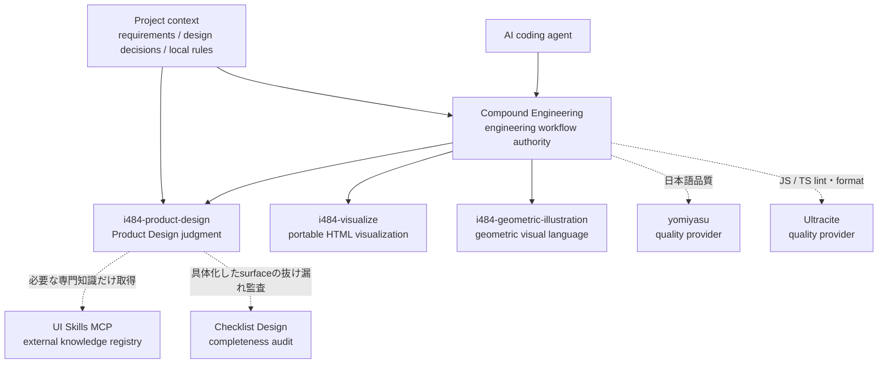
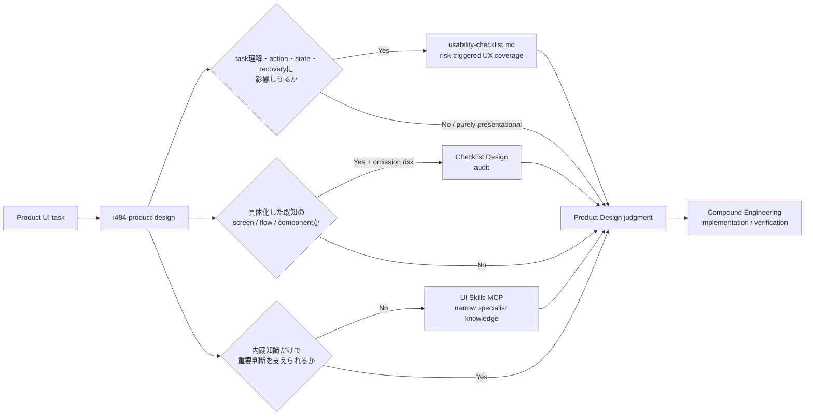

<div align="center">


# i484 Engineering

**Compound Engineeringを基盤に、専門知識を必要なときだけ重ねるAIコーディング環境。**

[](https://github.com/ishibashi-c/i484-engineering/actions/workflows/ci.yml)
[](LICENSE)
[](docs/guides/README.md)

</div>

## 概要

**i484 Engineering** は、[Compound Engineering](https://github.com/EveryInc/compound-engineering-plugin) をエンジニアリングの中核に据え、その上へi484固有の専門判断と外部専門知識を必要なときだけ重ねるAI coding environmentです。

planning、implementation、debugging、verification、review、Git、shipping、knowledge compoundingなど、**開発をどう進めるかはCompound Engineeringが所有**します。i484は第二のworkflowを作らず、Product Design・構造可視化・幾何学イラストレーションなど、CEが一般化して所有すべきでないdomain judgmentを追加します。

外部能力も同じ原則で接続します。UI Skills MCPは不足したUI専門知識を補うregistry、Checklist Designは具体化したscreen / flow / componentの抜け漏れを調べるauditor、yomiyasuとUltraciteはquality providerです。いずれもCEのworkflow authorityを置き換えません。

## 個人用開発環境の導入書

別のPCで採用環境を再構築するAI向けに、[個人用開発環境の導入書](docs/guides/personal-environment.md)を用意しています。導入元、採用する外部SkillとMCP、目的・使用条件、Global指示、確認方法を記載しています。これは個人の採用構成であり、i484 Engineering全利用者の必須設定ではありません。

## Architecture



> 矢印は責務と参照関係を示します。固定されたphase順序や第二workflowを表すものではありません。

### 現在の責務分担

| Layer | 主な責務 | 所有しないもの |
| --- | --- | --- |
| **Compound Engineering** | planning、実装、debug、verification、review、Git、shipping、knowledge compounding | Product Design固有の良し悪し |
| **i484-product-design** | UX、interaction、accessibility、composition、visual language、design evidence | engineering workflow、Git、shipping |
| **i484-visualize** | 説明・構造・比較をportable HTML artifactへ変換 | 一般的なWeb開発workflow |
| **i484-geometric-illustration** | i484固有の幾何学visual language | 一般的なsoftware engineering |
| **UI Skills MCP** | i484内蔵知識で不足する狭いUI専門知識の取得 | routing、workflow、review、Git |
| **Checklist Design** | 具体化したscreen / flow / componentのcompleteness audit | 一般的なdesign critique、最終設計判断 |
| **yomiyasu / Ultracite** | language / lintなど特定品質の判定 | quality gate全体の実行順序 |


## 設計原則

### 1. EngineeringはCompound Engineeringに任せる

i484は独自の第二workflowを作りません。作業分解、実装順序、検証量、review orchestration、branch / worktree / commit / PR / shippingなどはCompound EngineeringとProject固有の指示に委ねます。

Compound Engineeringとi484のengineering上の指示が競合する場合は、**Compound Engineeringを優先**します。

### 2. Skillは手順書ではなく専門能力として設計する

i484 Skillは、固定されたstate machineを増やすためのものではありません。主に次を与えます。

- 何を良い結果と判断するか
- その領域固有の制約
- 判断に必要な専門知識
- 品質基準
- 主張を支えるために必要なevidence
- 安全に失敗するための境界

実行手順そのものが正しさや安全性を構成する場合を除き、具体的な進め方はAgentとEngineering Frameworkに委ねます。

### 3. 旧i484は「守る構造」ではなく「採掘する資産」として扱う

旧`i484-workflow`、旧`i484-review`、旧`i484-core`をそのままCEへ融合していません。まずCompound Engineeringを新しいbaselineとし、旧i484から**CEに存在しない非engineering知識だけ**を再評価して移植します。

旧i484からの移行判断、CEとの責務境界、upstreamとの差分台帳は [`I484_ENGINEERING.md`](I484_ENGINEERING.md) を参照してください。

## i484 Specialist Skills

### `i484-product-design`

プロダクトUIに対する設計判断を支えるKnowledge Skillです。

主な対象:

- UX heuristics
- information hierarchy
- composition
- component semantics
- interaction design
- accessibility
- content stress
- error prevention / recovery
- data / visual / interaction parity
- design claimとevidenceの対応

実装工程やGit操作を指揮せず、**何を良いProduct Designと判断するか**に責務を限定しています。

#### Product Design内の判断レイヤー



この3つは競合するchecklistではありません。

- **UX coverage** — 「このUIはユーザーtaskとして成立しているか」をheuristicから確認する。UX-bearingな変更では`usability-checklist.md`を必ず読み、関係する観点だけ選ぶ。
- **Checklist Design** — 「LoginやSettingsなど、その種類のsurfaceとして重要な要素・stateが抜けていないか」を確認する。既定は`audit`で、一般的な`critique`はi484 Product Designの代替にしない。
- **UI Skills MCP** — 「この判断に必要な専門知識がi484内に足りない」ときだけ、最も狭く一致する外部Skillを取得する。


### `i484-visualize`

説明、構造、関係性、比較などを**単一のportable HTML artifact**として視覚化する専門Skillです。

一般的なWeb開発workflowではなく、「説明のためのartifactそのもの」が成果物である場合に使います。

### `i484-geometric-illustration`

i484独自の幾何学的なvisual languageでイラストレーションを設計・生成・評価する専門Skillです。

構図、面、余白、色、layer、series consistencyなどの視覚判断を担当し、software engineering全般はCompound Engineeringへ委ねます。

## External Specialist Registry

### UI Skills MCP

UI Skillsはi484へ一括導入せず、MCP経由の外部専門知識registryとして利用します。Codex向け配布には接続定義を同梱し、Skill本文やcatalog自体は複製しません。

- MCP: `https://www.ui-skills.com/mcp`
- discovery: `list_skills`
- fetch: `get_skill`

`i484-product-design`の内蔵知識だけでは重要なUI判断を十分に扱えず、現在のrunにも同等の専門知識がない場合だけ、最も狭く一致するSkillを取得します。取得したSkillのworkflowやrouterは採用せず、domain knowledgeだけをDesign判断へ加えます。

このrepositoryにはUI Skills catalogを複製しません。Codexでは`.mcp.json`経由で`ui_skills`接続を配布しますが、MCPが無効・未接続でもi484 Engineeringの通常機能はblockされません。

### Checklist Design

Checklist Designは、具体化したscreen / flow / componentに対する**completeness audit**として利用します。一般的なdesign critiqueは`i484-product-design`が担当し、Checklist Designは「その種類の画面・flowとして重要なものが抜けていないか」を補助的に確認します。

- upstream: `Checklist-Design/skills`
- default mode: `audit`
- `critique`: ユーザーがChecklist Design自身のcritiqueを明示的に求めた場合だけ
- unavailable / no match: blockせず、i484 Product Designで継続

Skill本体とchecklist corpusはこのrepositoryへ複製しません。利用するagent環境へ公式Skillを導入して使います。

## Quality Provider

### yomiyasu

ユーザー向け日本語を変更した場合に、日本語固有の自然さ、読みやすさ、機械的な文体を専門的に確認するQuality Providerとして利用します。

[nanaism/yomiyasu](https://github.com/nanaism/yomiyasu)の原版を独立した外部Skillとして利用します。このrepositoryへ同梱・独自改変せず、まとまった変更の確認をCompound Engineeringのquality gate内で行います。

### Ultracite

JS / TS ProjectでUltraciteを採用している場合、Project固有のlint / format providerとして利用します。

Compound Engineeringは「どの段階で品質確認を行うか」を所有し、Ultraciteは「JS / TSをどうlintするか」を担当します。

## 39 Skills

i484 Engineeringは39個のSkillを提供します。Compound Engineering由来の36個と、i484独自の3個です。次の表を、各Skillを含める理由と期待する成果の正本とします。詳しい使い方は[Skillガイド](docs/guides/README.md)、実行時の契約は各Skillの`SKILL.md`を参照してください。

「明示呼び出し」は`disable-model-invocation: true`のSkillです。9個が該当し、自動選択の候補には入りません。残る30個も毎回まとめて実行するものではありません。依頼と各Skillの説明が一致したときに選びます。上流由来の能力を同梱していることは、外部サービスの接続や継続監視の開始を意味しません。

### 開発の中心

| Skill | 導入して期待する成果 | 使用する場面 | 選択 |
| --- | --- | --- | --- |
| `ce-ideate` | 取り組む価値のある案を、根拠と比較軸を添えて見つける | 方向がまだ決まっていないとき | 説明に応じて選択 |
| `ce-brainstorm` | 要求と未決定事項を整理し、実装前の認識をそろえる | 何を作るかが曖昧なとき | 説明に応じて選択 |
| `ce-plan` | 範囲、制約、検証方法をそろえた実装可能な計画を作る | 複数工程や重要な判断があるとき | 説明に応じて選択 |
| `ce-work` | 具体的な依頼を実装し、必要な検証まで完了する | 計画または明確な実装依頼があるとき | 説明に応じて選択 |
| `ce-compound` | 再発防止や再調査の削減につながる知識を残す | 最終コードから読み取れない学びがあるとき | 説明に応じて選択 |

### 戦略・継続的改善

| Skill | 導入して期待する成果 | 使用する場面 | 選択 |
| --- | --- | --- | --- |
| `ce-strategy` | 製品の目的、対象、判断の前提を保つ | 戦略の作成・更新 | 説明に応じて選択 |
| `ce-product-pulse` | 利用状況、性能、障害から次の改善を判断する | 観測期間と対象を指定した定期評価 | 明示呼び出し |
| `ce-sweep` | 外部のフィードバックを実行可能な作業へ整理する | 取得元と対象を指定した継続的な整理 | 明示呼び出し |
| `ce-compound-refresh` | 蓄積した知識を現在の実装に合わせて保守する | 学習文書の陳腐化や重複を整理するとき | 説明に応じて選択 |

### 調査・設計・改善

| Skill | 導入して期待する成果 | 使用する場面 | 選択 |
| --- | --- | --- | --- |
| `ce-bakeoff` | 独立した複数案を同じ条件で比較して選ぶ | 重要な技術選択が残るとき、または比較の依頼 | 説明に応じて選択 |
| `ce-pov` | プロジェクトの根拠と制約に沿って採否を判断する | 提案、技術、文書の評価 | 説明に応じて選択 |
| `ce-explain` | 現在の実装や設計の理由を根拠付きで説明する | 仕組みや経緯の理解 | 説明に応じて選択 |
| `ce-prototype` | 試作品で使い方や体験を確かめ、決定事項へ戻す | 実装前に体験を確かめたいとき | 説明に応じて選択 |
| `ce-debug` | 症状と原因を切り分け、原因に対応した修正へつなぐ | 不具合調査の既定 | 説明に応じて選択 |
| `ce-code-review` | 差分の不具合、回帰、検証不足を根拠付きで指摘する | コードレビューの既定 | 説明に応じて選択 |
| `ce-doc-review` | 要求や計画の欠落、矛盾、実行上の問題を見つける | 仕様・計画のレビュー | 説明に応じて選択 |
| `ce-simplify-code` | 挙動を保って最近の実装を読みやすく整理する | 実装が落ち着いた後の整理 | 説明に応じて選択 |
| `ce-optimize` | 測定結果で改善の効果を判断する | 性能や費用など測定可能な対象の改善 | 説明に応じて選択 |
| `ce-retune` | モデル変更に伴うSkillの効果を測って調整する | 現在のモデルと対象を指定した再評価 | 明示呼び出し |

### i484 Specialists

| Skill | 導入して期待する成果 | 使用する場面 | 選択 |
| --- | --- | --- | --- |
| `i484-product-design` | UX、構成、操作、アクセシビリティの設計判断を補う | 製品UIの判断が必要なとき。工程はCEが担当 | 説明に応じて選択 |
| `i484-visualize` | 説明や比較を持ち運べる単一HTMLへまとめる | 説明用HTML自体が成果物のとき | 説明に応じて選択 |
| `i484-geometric-illustration` | i484の幾何学表現で図版を生成・評価する | その視覚表現のイラストが必要なとき | 説明に応じて選択 |

### 調査資料

| Skill | 導入して期待する成果 | 使用する場面 | 選択 |
| --- | --- | --- | --- |
| `ce-riffrec-feedback-analysis` | 録画された製品フィードバックを問題と要求へ整理する | Riffrec録画の分析 | 説明に応じて選択 |

### Git・作業分離

| Skill | 導入して期待する成果 | 使用する場面 | 選択 |
| --- | --- | --- | --- |
| `ce-commit` | 今回の対象差分だけを明確な単位でコミットする | ローカルコミットの依頼または権限があるとき | 説明に応じて選択 |
| `ce-commit-push-pr` | 検証済み差分をPRとしてレビュー可能にする | push・PR作成または説明更新の依頼 | 説明に応じて選択 |
| `ce-babysit-pr` | CIとレビューの変化を追い、必要な対応を進める | 特定PRの継続監視の依頼 | 説明に応じて選択 |
| `ce-worktree` | 既存変更を保護しながら作業を分離する | 作業分離が必要なとき | 説明に応じて選択 |

### 自律実行

| Skill | 導入して期待する成果 | 使用する場面 | 選択 |
| --- | --- | --- | --- |
| `lfg` | 依頼から実装、レビュー、PRまで工程をまとめて進める | 工程全体を任せる依頼。外部操作は有効な権限に従う | 説明に応じて選択 |

### UI・検証・共同編集

| Skill | 導入して期待する成果 | 使用する場面 | 選択 |
| --- | --- | --- | --- |
| `ce-polish` | 動作するUIを実画面で確認しながら磨く | 対象機能を指定したUI調整 | 明示呼び出し |
| `ce-proof` | ProofでMarkdownを公開・取得・コメントする | Proof上の対象操作の依頼 | 説明に応じて選択 |
| `ce-dogfood` | 利用者の操作を通して画面の問題を見つけ、修正する | 対象ブランチのブラウザQA | 明示呼び出し |
| `ce-test-browser` | 変更した画面と操作をブラウザで検証する | Web UIの変更検証の既定 | 説明に応じて選択 |
| `ce-test-xcode` | iOSアプリのビルドとシミュレーター動作を確かめる | iOSアプリの検証 | 明示呼び出し |

### 補助機能

| Skill | 導入して期待する成果 | 使用する場面 | 選択 |
| --- | --- | --- | --- |
| `ce-noslop` | 事実を保ちながら読みやすい文章に整える | 文案・文書の整理。日本語品質はyomiyasuを併用 | 説明に応じて選択 |
| `ce-promote` | 公開済み機能の告知文案を作る | 告知の下書き作成 | 明示呼び出し |
| `ce-resolve-pr-feedback` | PRの指摘を評価し、妥当な修正と返信を行う | 特定PRへのフィードバック対応 | 説明に応じて選択 |
| `ce-setup` | 必要なツールとプロジェクト設定を診断・整備する | 対象プロジェクトの設定確認・修復 | 明示呼び出し |
| `ce-handoff` | 次の担当が再開できる状態と根拠を引き継ぐ | 引き継ぎの作成・読取。読取だけで自動再開しない | 説明に応じて選択 |
| `wtf` | 指定された内容を平易に説明する | 直前の説明や指定資料を読み解く依頼 | 明示呼び出し |

### 能力を追加・削除するときに、この表も更新する

Skill、MCP、プラグインを追加・削除した場合や責務を変えた場合は、同じ変更で対応する表の期待、使用条件、境界を更新します。配布に含めるSkillはこのREADME、環境固有の接続・外部Skillは利用環境のREADMEで管理します。登録済み、選択可能、実際に利用した、検証済みの状態を区別し、READMEへの記載だけで実動作を保証しません。

Behavior Studioによる環境管理は終了し、READMEを維持する方式に移行します。旧構成や旧モデルでの評価を現在の合格根拠に使わず、必要な評価は現在の対象で実施します。由来、ライセンス、上流との差分は既存の正本で保持します。

## 導入

### Codex App

Custom marketplaceとしてこのrepositoryを登録します。

| Field | Value |
| --- | --- |
| Source | `ishibashi-c/i484-engineering` |
| Git ref | `main` |
| Sparse paths | 空欄 |

登録後、`i484-engineering`をinstallしてCodexを再起動します。

### Codex CLI

```bash
codex plugin marketplace add ishibashi-c/i484-engineering
codex plugin add i484-engineering@i484-engineering-plugin
```

配布上のMarketplace IDは`i484-engineering-plugin`、Plugin IDは`i484-engineering`です。CE由来のSkill名（`ce-*`）はupstreamとの意味・由来を保つため変更しません。

### Skillの呼び出しと実装担当

一般的な呼び出しは`/skill-name`、Codexでは`$skill-name`を使います。たとえば`$ce-plan`と`$lfg`です。oh-my-piで自動選択に公開されない明示呼び出しSkillは`/skill:<name>`で直接呼び出します。`/goal`はCodexの組み込み機能です。

実装を別モデルへ委任する場合は、利用可能で能力条件を満たす実装担当（qualified author）を選び、呼び出し元が差分と検証を統合します。詳細は[ce-workガイド](docs/guides/ce-work.md)を参照してください。

### Optional external specialists

Codex向けi484 EngineeringにはUI Skills MCPの**接続定義**を同梱しています。catalog本文はvendoringせず、利用可能な場合だけ`i484-product-design`から必要な知識を取得します。

Checklist Designは公式Skillを外部のまま導入します。

```bash
npx skills add checklist-design/skills -a codex
```

Checklist Designが未導入でもi484 Engineeringはblockされません。導入されている場合だけ、具体化したscreen / flow / componentに直接一致するchecklistをcompleteness auditへ利用します。

### その他のhost

Claude Code、Cursor、Kimi、Cline、Devin、OpenCode、Piなどに対応するdistribution metadataはCompound Engineeringから継承しています。

これらはSkill本体を複製しているのではなく、各hostから同じ`skills/`を利用するための互換レイヤーです。配布上の名称・作者・repositoryはi484 Engineeringに統一し、CE由来のSkill名とengineering semanticsは維持します。

## Upstreamとの関係

このrepositoryは [EveryInc/compound-engineering-plugin](https://github.com/EveryInc/compound-engineering-plugin) のGitHub forkです。

```text
EveryInc/compound-engineering-plugin
              │
              │ upstream
              ▼
ishibashi-c/i484-engineering
              │
              └── i484 specialist additions
```

upstream更新時はCompound Engineeringの変更を取り込みます。同じ箇所で競合した場合はCEの新しいengineering semanticsを優先し、その上でi484固有要素が非競合に残せる場合だけ再適用します。

CE本体へのpatchを小さく保ち、i484固有の知識は原則として`i484-*` Skillやi484-owned documentへ分離することで、upstreamとのmerge conflictを抑えます。意図的なCE-native patchとそのretirement条件は [`I484_ENGINEERING.md`](I484_ENGINEERING.md) の差分台帳を正本とします。

## Attribution

Compound Engineeringを基盤としていることを明示し、upstreamのMIT Licenseとcopyright noticeを保持しています。

- Original project: [Compound Engineering](https://github.com/EveryInc/compound-engineering-plugin)
- Organization: Every Inc.
- Upstream maintainers: Kieran Klaassen / Trevin Chow
- License: MIT

詳細な由来と移植元は [`ATTRIBUTION.md`](ATTRIBUTION.md) を参照してください。

## License

MIT Licenseで公開しています。

- `Copyright (c) 2025 Every`
- `Copyright (c) 2026 ishibashi-c`

元のCompound Engineeringに対する著作権表示を保持しつつ、i484独自の追加部分についてもcopyright noticeを明記しています。詳細は [`LICENSE`](LICENSE) を参照してください。

---

i484 Engineeringは、Compound Engineeringと競争するためのframeworkではありません。**Engineeringの進め方はCEから継承し、i484はその上で専門性を追加する**ことを基本方針としています。

## 品質設定と差分検査

JS/TSのlint・format・checkはUltracite（Biome）に統一します。既存のコードやテストfixtureを一括変更せず、まとまった変更を一度確認します。

- `bun run check`: 基準履歴からの変更、未commitの変更、新規ファイルを検査します。
- `bun run format`: 同じ対象を整形します。
- `bun run quality:doctor`: 導入と設定の整合を確認します。
- `bun run check:all`: 既存コード全体を診断します。既存の指摘も出るため、現在のmerge gateには使いません。

既定の基準は`origin/main`です。CIではPRのbaseまたはpush前の履歴を`QUALITY_BASE`で指定します。基準が見つからない場合は失敗させ、検査対象が消えたように扱いません。意図的に不正な入力を含む`tests/fixtures/`と、生成物は対象外です。逐次的なファイル操作、型alias、キー順序、テストfixture構築の例外は`biome.jsonc`に明示します。新規プロジェクトでは既存コード向けの例外を無条件に引き継ぎません。
