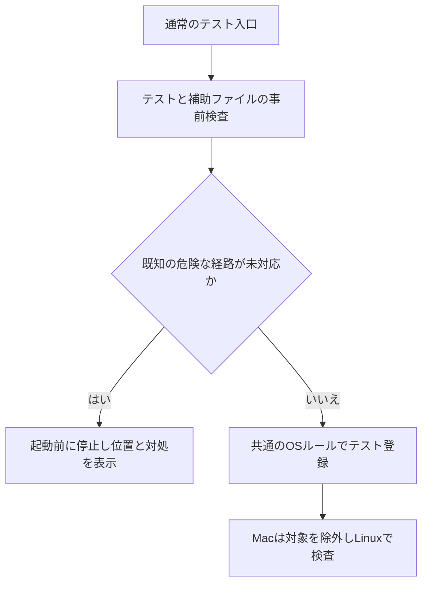
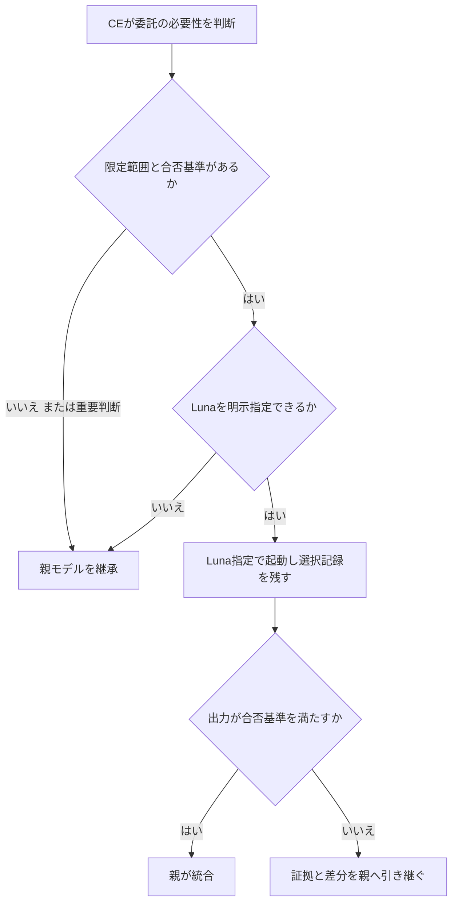

# テストのクラッシュ通知とサブエージェントのモデル選択を改善する

## Goal Capsule

Objective: 開発中に今回確認したmacOSのテスト由来のクラッシュ通知が再発せず、品質を確認できる委託作業では軽量モデルを使えるようにする。

Means: テスト用の共通安全ルールと実行前検査、CEの各委託地点での作業分類とモデル選択記録を導入する。KTD1〜KTD4で設計を定める。

工程はCEが担当する。現行のシグナル処理とレビューの責務を保ち、ユーザー指示を優先する。この依頼で作成するのは計画であり、実装・設定変更・公開は行わない。実装時に対象が変わる判断や新たな課金が必要なら、その操作を止めて報告する。

---

## Product Contract

### Summary

macOSで通知を出す意図的なプロセス終了を、個別テストの注意書きに頼らず防ぐ。サブエージェントには作業の範囲と検証方法に応じたモデルを指定し、軽量モデルを使わなかった理由も確認できるようにする。

### Problem Frame

既存の2テストはPythonとBunをSIGQUITで終了させ、macOSのクラッシュ通知を出していた。3.31.0では該当項目をMacでスキップしたが、同種の検査を追加した際の共通ルールはない。

CEにはモデル階層のルールがある。重要なレビューは親モデルを継承し、その他は中位モデルへ下げる設計のため、Solの親からLunaへ作業を振り分ける条件が不足している。モデルを指定した記録も、実際の提供モデルを保証しない。

### Requirements

R1. macOSでは、通知を起こす意図的なクラッシュ検査を共通ルールで除外する。今回確認したSIGQUITを必ず対象に含める。

R2. 現行のLinuxでのSIGQUIT検査とMacのSIGINT・SIGTERM・SIGHUP検査を維持する。プロセスグループの後始末と終了状態の契約は変更しない。

R3. 通常のテスト入口で、未承認の危険な検査を子プロセス起動前に検出する。検出対象、見逃し得る経路、直接実行による迂回は明記する。

R4. 委託が必要で、範囲が限定され、入力と合否基準を渡せる作業は、利用可能なLunaを先に選ぶ。短い作業を節約のためだけにサブエージェント化しない。

R5. 正しさ・安全性・敵対的な故障分析のレビュー、全体設計、最終統合判断は親モデルに残す。親が軽量モデルの場合も自動で上位へ変更しない。

R6. Lunaの起動不可や出力の検証不合格は親モデルへ引き継ぐ。同じ作業の無制限な再試行や、未許可の別プロバイダー・有料APIへの切り替えを行わない。

R7. 委託ごとに作業分類、選択理由、指定モデル・推論設定、起動結果、検証結果を記録する。提供側の証拠がない実行モデルは未確認とする。

R8. 配布版、Global指示、導入書、PCの確認記録で同じ方針を扱う。Lunaへの指定成功、実モデルの確認、成果の合格、費用削減の測定を区別する。

### Acceptance Examples

AE1. Macで通常の全体テストを実行すると、危険な項目は理由付きで除外され、安全なシグナル検査は実行される。Python・Bunの新しいクラッシュ記録が増えない。Covers R1, R2.

AE2. 新しいテストに共通ルールを通さない直接のSIGQUIT送信を追加すると、通常の入口は実行前にファイル位置と修正方法を示して停止する。実際のSIGQUITは送らない。Covers R3.

AE3. リンク照合や件数確認を委託すると、Lunaを指定した起動引数と合否の証拠が記録される。単にプロンプトへLunaと書く方法では満たさない。Covers R4, R7.

AE4. Lunaの起動が拒否された場合や、修正後の既存検査が失敗した場合は、失敗理由と差分を親へ返す。作業を並行して二重実装しない。Covers R6.

AE5. 親がLunaの重要レビューはLunaを継承する。Solへ自動昇格せず、判定できないことがあれば不足を報告する。Covers R5.

### Scope Boundaries

対象はこのリポジトリのテストとCEが起動するネイティブのサブエージェントである。実装エンジンを明示指定する既存のcross-model executionや、ユーザー指定のレビュー先はこの既定ルールで置換しない。

Pythonのあらゆる異常終了を防ぐ保証、macOSの通知機能の停止、Pythonの再導入は対象外とする。全OSのプロセス隔離、新しい委託サービス、常駐監視、自動課金、モデルの価格表の保守も追加しない。ここで必要なのは、確認済みの失敗経路と委託判断の不足を閉じることだからである。

### Success Criteria

今回の原因に対するMacでの再発0件、Linuxの対象検査の欠落0件を受け入れ条件とする。限定作業の評価ケースでは、Lunaを利用できる場合の指定漏れ0件、重要判断の自動降格0件、未確認のモデルや費用の断定0件を求める。

---

## Planning Contract

### Key Technical Decisions

KTD1. 共通ルールをテスト側へ置く。`tests/helpers/process-safety.ts`を新設し、現在の2ループから利用する。Macでの除外、理由、Linuxで検査する対象を一箇所で管理する。運用スクリプトが受けたSIGQUITを別の終了状態へ変更する案は、既存契約を変えるため採らない。Governs R1, R2.

KTD2. 実行前検査は、リポジトリ管理下のテストと利用するプロセス補助ファイルを対象にする。Bunの選択結果を再現する仕組みは作らない。通常の入口から共通検査を呼び、明示された外部fixtureは別途対象を確認する。直接の危険なシグナル送信と共通ヘルパーを迂回する経路を検出する。コメントだけの承認では通さず、許可する経路は共通ヘルパーへの参照と対応テストで確認する。動的なコード生成や解析できない別名は、検査の保証外または手動判断が必要な警告として扱う。Governs R3.

KTD3. 作業の意味を判断するのは委託するCEの担当Skillである。新しい中央オーケストレーターは作らず、既存の委託ルールを「限定作業」「重要判断」の2区分へ整える。設定のLuna指定とホストの起動引数を結び付ける。コードによる本文分類や単純なファイル拡張子判定ではモデルを決めない。Governs R4, R5.

KTD4. 限定作業のLuna実行は1回を基本とし、結果は親が既存の合否基準で検証する。起動前の引数ミスは1回だけ訂正できる。同時実行数の制限はモデル不適合と扱わず、枠が空くまで待つ。利用不可・不合格の場合は、その作業を親が引き継ぐ。親の継承は許可された上限であり、それ以上への変更は行わない。Governs R6.

KTD5. 選択記録は既存のCE実行記録に短く追記し、通常の報告では集計だけを示す。要求モデルと実モデルの欄を分ける。実モデルの未確認だけを理由に再実行して利用量を増やさない。費用の実測情報がなければ、Luna指定件数・親への引き継ぎ件数・不合格理由を報告する。Governs R7, R8.

### Model Choice

この個人環境では限定作業の候補を`gpt-6-luna`、推論設定を`medium`とする。これは計画上の既定値で、すべてのホストへ同じIDを強制する意味ではない。親のモデル・利用可能な指定方法・階層が確認できないホストでは、理由を残して継承する。

Lunaが適する候補は、出典の抽出、件数とリンクの照合、決定済みの文書反映、原因と修正が確定した小さな変更である。合否基準を用意できない作業は、候補の名前に一致しても自動で下げない。委託単位でLunaの適用を判断する。

### High-Level Technical Design

### Assumptions

この計画では、日常の細部の判断をエージェントに委任する方針を引き継ぐ。Lunaのmedium設定、1回の軽量実行、既存の親へ戻す条件は今回の計画で提案する既定値である。

事前検査は完全な静的解析ではない。実装では直接送信・配列のシグナル値・Python補助処理を確認できる最小の検出器を選び、その限界を具体的なfixtureで示す。追加依存や既存fixtureの大量除外が必要になった場合は、先に仕組みの縮小を検討する。

ホストが実際の提供モデルを証明できるかは実装時に確認する。Codex CLIでLunaが利用できなかった過去の結果を、ネイティブのサブエージェント経路の利用可否へ流用しない。

---

## Implementation Units

### U1. プロセステストの共通ルール

Goal: 現在のMacでの除外を共通化し、新しい検査にも同じ判断を使えるようにする。

Requirements: R1, R2. Dependencies: なし。

Files: 新規`tests/helpers/process-safety.ts`、新規`tests/process-safety.test.ts`、既存`tests/run-tests-script.test.ts`、`tests/skills/helpers/ce-work-workspace-harness.test.ts`。

Approach: KTD1に従い、現在の2ループを移行する。新しい危険な検査は理由と代わりに検査する環境を登録する。Macで本物のクラッシュを起こしてルールを検証しない。

Test scenarios

- DarwinとSIGQUITでは実行対象にならず、理由が返る。Covers AE1.
- LinuxとSIGQUITは実行対象になる。Covers AE1.
- DarwinのSIGINT・SIGTERM・SIGHUPは実行対象になる。
- 未登録の危険な検査を安全な検査として扱わない。

Verification: 合成したOS値の単体検査と、既存の安全な実プロセス検査が通る。終了状態と子孫プロセスの後始末の期待値を維持する。

### U2. テスト起動前の検査

Goal: 新しい危険な検査の追加漏れを、実行前に発見する。

Requirements: R3. Dependencies: U1。

Files: 新規`scripts/check-process-test-safety.ts`、新規`tests/process-test-safety-check.test.ts`、既存`scripts/run-tests.ts`、`tests/run-tests-script.test.ts`。

Approach: KTD2に従う。通常の入口が使う解析対象を明示し、危険な検査を除外するルールの削除も確認する。fixtureの本文は不活性なデータとして読み、実行しない。

Test scenarios

- 未対応の直接SIGQUIT送信を含むfixtureでは、子プロセスを起動せず停止する。Covers AE2.
- 正式な共通ルールを利用する現在の2ループは通る。
- コメントや引用文字列、運用側のシグナル転送は誤って禁止しない。
- 共通ルールの呼び出しを削除したfixtureは停止する。
- Pythonの自己再送信経路と、その安全な呼び出し元の境界をfixtureで確認する。
- 検査対象を読めない場合は、検査済みと扱わず原因を表示する。

Verification: 実行前の停止を無害なfixtureで確認する。テストの失敗をスキップや再試行へ変換せず、通常のテスト実行と既存の並列失敗処理を保持する。

### U3. CEの委託モデル選択を統一

Goal: 軽量モデルを選ぶ判断を各委託地点で行い、選択漏れを確認できるようにする。

Requirements: R4〜R7. Dependencies: なし。

Files: `skills/ce-code-review/references/dispatch-reviewers.md`、`skills/ce-doc-review/references/dispatch.md`、`skills/ce-simplify-code/SKILL.md`、`skills/ce-plan/references/research.md`、`skills/ce-explain/references/orchestration.md`、`skills/ce-work/references/implementation-loop.md`、`.compound-engineering/config.example.yaml`、`skills/ce-setup/references/config-template.yaml`、`tests/review-skill-contract.test.ts`、新規`tests/subagent-model-policy.test.ts`。

Approach: KTD3〜KTD5に従う。実装開始時に現在のネイティブ委託地点を照合し、対象Skillの読み込み経路へルールを置く。ホストごとのモデル指定は設定例で示し、汎用の配布本文にはモデル名の更新を重複させない。共有本文の複製が必要な場合は、既存の配布上の制約に従って同一性を検査する。

Test scenarios

- bounded分類は明示モデル指定、critical分類は親継承を要求する契約になっている。
- Lunaの親を中位モデルへ昇格させる既存の誤りを再導入しない。
- モデル指定不能と同時実行枠の不足を別の状態として扱う。
- 実モデル不明の実行を「Lunaで実行確認」と記録しない。
- 既存のユーザー指定実装エンジンやレビュー先を上書きしない。

Verification: 契約検査は配布上の経路と記録形式を確認する。作業分類の正しさはU4の新しい読解コンテキストで検証する。文章検査だけで実際のモデル選択を証明したとは扱わない。

### U4. 実際の委託と失敗時の引き継ぎを評価

Goal: Lunaへの指定と合否判定が、説明文だけでなく実際の起動で機能することを確かめる。

Requirements: R4〜R7. Dependencies: U3。

Files: 新規`tests/skill-eval-cases/subagent-model-routing.md`。実行証拠はCEの一時実行記録に保存し、リポジトリへ秘密情報やセッション全文を含めない。

Approach: 現行の評価基盤を再利用する。まず無害な抽出・照合を評価し、次に小さな修正と既存検査の合否を評価する。起動失敗と出力不合格はfixtureで検査し、同じ依頼を繰り返す大規模なモデル比較は行わない。

Test scenarios

- 限定された参照先の抽出ではLunaを明示指定する。Covers AE3.
- 原因が確定したリンク修正では、指定モデルと既存リンク検査の合格を記録する。
- 安全性の最終判断は親モデルに残す。
- Luna拒否と成果不合格の双方で、証拠を渡して親へ引き継ぐ。Covers AE4.
- 同時実行枠の不足では、親へ切り替える前に枠の解放を待つ。
- 親がLunaのとき上位へ自動昇格しない。Covers AE5.
- 実モデルが証明されない場合も結果は使えるが、モデルの実行確認は未確認と記録する。

Verification: 起動引数、選択理由、成果の合否、親への引き継ぎを確認する。起動できない環境は不合格扱いで隠さず、利用不可時の契約だけを確認したと報告する。費用削減率は実測なしで提示しない。

### U5. 方針・導入書・配布の整合

Goal: 次の改善作業と別PCでの導入にも今回の仕組みを引き継ぐ。

Requirements: R8. Dependencies: U1〜U4。

Files: `AGENTS.md`、`I484_ENGINEERING.md`、`docs/guides/personal-environment.md`、`README.md`。実装時にはリポジトリ外のGlobal指示とPC確認記録も対象箇所だけ更新する。

Approach: テスト追加時の共通ルール、危険なテストのLinux側での検査、モデル選択の条件と限界を記載する。macOSのCrashReporter設定を変更する手順は追加しない。既存の金銭・本人認証の境界を保持する。

Test expectation: 文書自体の単体テストは追加しない。リンク・配布整合・日本語品質と実装証拠を確認する。

Verification: READMEから導入書へ到達でき、CEの実行時契約とGlobal指示が一致する。レビュー、通常のGitHub更新、リリースとこのPCの公式更新までを、実装が依頼された際の完了範囲に含める。

---

## Verification Contract

U1とU2は、クラッシュを起こさないfixtureを先に検査する。対象検査、`bun run check`、`bun run release:validate`を通した後、通常の`bun run test`で全体を確認する。Linux CIで現行のSIGQUIT対象が実際に実行され、スキップが増えていないことを確認する。

Macでは実行前後のPython・Bunの診断記録を比較する。記録本文を公開せず、追加件数と対象時刻だけを確認記録に残す。これは今回の経路の再発確認であり、すべての異常終了が起こらない証明ではない。

U3とU4は静的な契約検査と、ネイティブの起動記録を用いた評価を分ける。Lunaへの指定を最低1件で実行し、成果の合格を親が確認する。利用不可で代替契約しか確認できなければ、Luna利用の完了とは報告しない。

変更した日本語文書は、まとまった段階でyomiyasuを使う。レビューでは誤った安全保証、モデル継承の自動昇格、未測定の削減効果、既存の重要レビューの欠落を確認する。全体検査を、変更や失敗の根拠なく繰り返さない。

---

## Definition of Done

共通ルールが現行の2ループで使われ、通常の入口で未対応の危険なfixtureを起動前に止める。Macで今回の通知が再発せず、LinuxとMacの残りの検査を維持する。

対象CEの委託地点で作業分類と実際の起動引数が一致し、限定作業のLuna指定と検証結果を確認できる。重要判断は親を継承し、失敗時の引き継ぎが収束する。破棄した試作や重複ルールを差分から除く。

導入書と確認記録は、設定済み・指定成功・実モデル確認・成果合格を区別する。実装が依頼された場合は、検証済み差分のレビューとGitHub更新、公式CLIによるこのPCの更新まで確認する。

---

## Sources and Remaining Limits

既存の根拠は`tests/run-tests-script.test.ts`、`tests/skills/helpers/ce-work-workspace-harness.test.ts`、`tests/skills/helpers/run-in-group.py`、`scripts/run-tests.ts`の現在の本文である。モデル選択は各CEの委託参照と`I484_ENGINEERING.md`のC4を確認した。

配布上の共有本文の制約は`docs/solutions/workflow/reviewing-byte-duplicated-shared-assets.md`、モデル名の証拠の区別は`docs/solutions/skill-design/requested-vs-verified-model-identity.md`に従う。

この計画ではテストを実行せず、クラッシュも再現していない。事前検査の検出精度、ネイティブ実行のモデル証拠、Lunaでの修正成功率と費用削減は、実装時の評価対象である。
